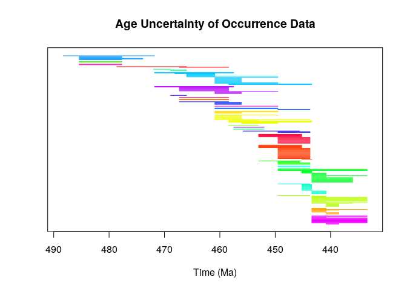
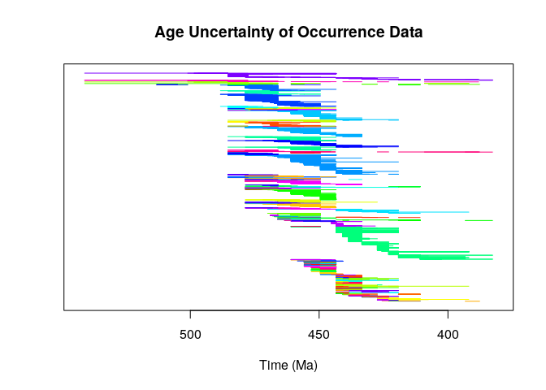
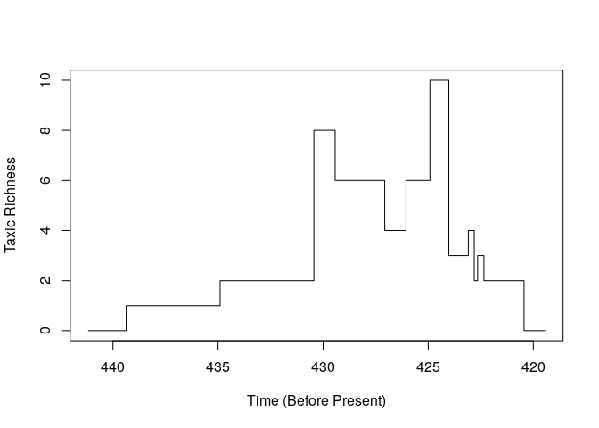

    library(paleobioDB)

    ## Loading required package: raster

    ## Loading required package: sp

    ## Loading required package: maps

    library(paleotree)

    ## Loading required package: ape

    ## 
    ## Attaching package: 'ape'

    ## The following objects are masked from 'package:raster':
    ## 
    ##     rotate, zoom

    data(graptPBDB)
    head(graptOccPBDB)

    ##   occurrence_no record_type reid_no obsolete collection_no
    ## 1          1669  occurrence      NA       NA           215
    ## 2          2186  occurrence      NA       NA           256
    ## 3          2216  occurrence      NA       NA           258
    ## 4          2217  occurrence      NA       NA           258
    ## 5          2318  occurrence      NA       NA           270
    ## 6          2319  occurrence      NA       NA           270
    ##      identified_name identified_rank identified_no taxonomic_reason
    ## 1  Chaunograptus sp.           genus         33800                 
    ## 2  Dendrograptus sp.           genus         33551                 
    ## 3 Acanthograptus sp.           genus         33536                 
    ## 4  Dendrograptus sp.           genus         33551                 
    ## 5  Dendrograptus sp.           genus         33551                 
    ## 6   Hallograptus sp.           genus         33673                 
    ##    accepted_name accepted_rank accepted_no early_interval late_interval
    ## 1  Chaunograptus         genus       33800      St Davids     St Davids
    ## 2  Dendrograptus         genus       33551  Trempealeauan Trempealeauan
    ## 3 Acanthograptus         genus       33536       Cambrian      Cambrian
    ## 4  Dendrograptus         genus       33551       Cambrian      Cambrian
    ## 5  Dendrograptus         genus       33551       Tremadoc      Tremadoc
    ## 6   Hallograptus         genus       33673       Tremadoc      Tremadoc
    ##   early_age late_age reference_no   primary_name primary_reso
    ## 1     513.0    501.0           13  Chaunograptus             
    ## 2     501.0    485.4           13  Dendrograptus             
    ## 3     541.0    485.4           13 Acanthograptus             
    ## 4     541.0    485.4           13  Dendrograptus             
    ## 5     485.4    477.7           13  Dendrograptus             
    ## 6     485.4    477.7           13   Hallograptus             
    ##   subgenus_name subgenus_reso species_name species_reso subgenus
    ## 1                                      sp.                    NA
    ## 2                                      sp.                    NA
    ## 3                                      sp.                    NA
    ## 4                                      sp.                    NA
    ## 5                                      sp.                    NA
    ## 6                                      sp.                    NA
    ##   subgenus_no          genus genus_no family family_no        order
    ## 1          NA  Chaunograptus    33800               NA             
    ## 2          NA  Dendrograptus    33551               NA   Dendroidea
    ## 3          NA Acanthograptus    33536               NA   Dendroidea
    ## 4          NA  Dendrograptus    33551               NA   Dendroidea
    ## 5          NA  Dendrograptus    33551               NA   Dendroidea
    ## 6          NA   Hallograptus    33673               NA Graptoloidea
    ##   order_no         class class_no       phylum phylum_no   authorizer
    ## 1       NA Graptolithina    33534 Hemichordata     33518 Sepkoski, J.
    ## 2    33535 Graptolithina    33534 Hemichordata     33518 Sepkoski, J.
    ## 3    33535 Graptolithina    33534 Hemichordata     33518 Sepkoski, J.
    ## 4    33535 Graptolithina    33534 Hemichordata     33518 Sepkoski, J.
    ## 5    33535 Graptolithina    33534 Hemichordata     33518 Sepkoski, J.
    ## 6    33606 Graptolithina    33534 Hemichordata     33518 Sepkoski, J.
    ##       enterer modifier
    ## 1 Sommers, M.  unknown
    ## 2 Sommers, M.  unknown
    ## 3 Sommers, M.  unknown
    ## 4 Sommers, M.  unknown
    ## 5 Sommers, M.  unknown
    ## 6 Sommers, M.  unknown

    occSpecies<-taxonSortPBDBocc(graptOccPBDB, rank="species")

    #plot it!
    plotOccData(occSpecies)

    #this isn't too many occurrences, because there are so few
        #formal grapt species in the PBDB

    #genera is messier...

    #get formal genera
    occGenus<-taxonSortPBDBocc(graptOccPBDB, rank="genus")

    #plot it!
    plotOccData(occGenus)

    #taxicDivDisc with the retiolinae dataset
    data(retiolitinae)
    taxicDivDisc(retioRanges)

